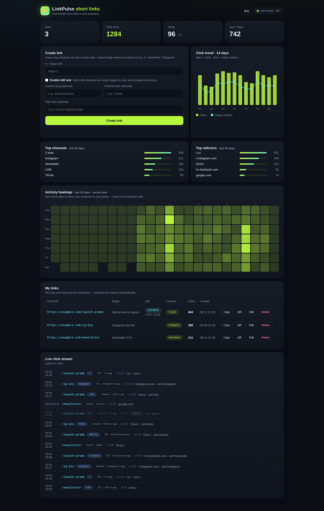
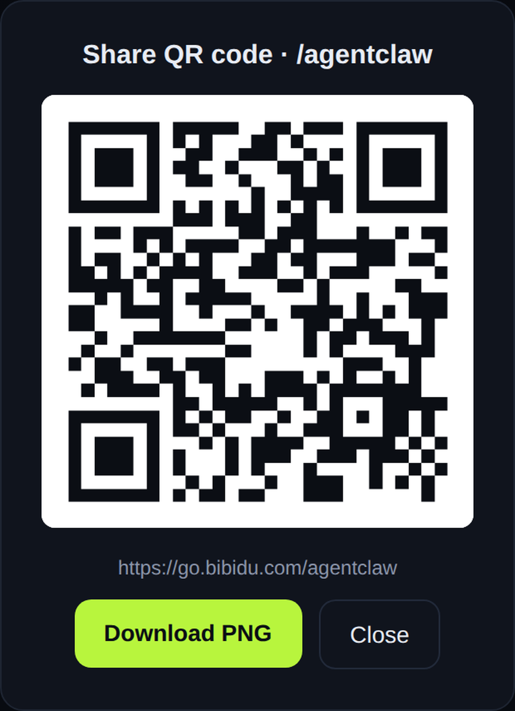

# ⚡ LinkPulse 链光

> **Self-hosted short-link service with click analytics that understands Chinese social apps.**
> 自建短链服务 —— 天生看懂微信 / QQ / 微博。



## 为什么是 LinkPulse

市面上的短链服务（Bitly、Dub、Shlink…）没有一个能告诉你：**这次点击来自微信内置浏览器还是 Safari**。
做中文推广的人都知道，这个区别决定了你要不要做微信内的落地页适配 —— 而 LinkPulse 把它做成了第一公民。

- **微信生态归因**：识别微信 / QQ / 微博内置浏览器、手机系统、浏览器、系统语言
- **隐私优先**：访客原始 IP 从不落盘，只存加盐 SHA-256 哈希（16 位 hex，不可逆）
- **A/B 测试**：一条短链、两个目标页、按权重分流，分版本统计点击
- **推广二维码**：每条短链一键生成 480px PNG，直接下载
- **24×7 活跃热力图**：近 30 天、按北京时间聚合，一眼看出用户什么时候最活跃
- **实时点击流**：最近访问明细，30 分钟重复点击自动标记，UTM 参数透传
- **单用户、零依赖**：Express + PostgreSQL，原生 JS 前端，无构建步骤

## 一分钟跑起来

```bash
cp .env.example .env        # 填好 ADMIN_PASSWORD / IP_SALT 等
docker compose up -d --build
```

打开 `http://localhost:8080`，输入你设置的 `ADMIN_PASSWORD`，开始创建短链。

> 生产环境请配好反向代理（HTTPS）+ 自定义域名，并设置强密码。

## 功能一览

| 功能 | 说明 |
|---|---|
| 短链创建 | 自定义短码（可选）、渠道备注（如：朋友圈 / 推文 / 群发）、标题备注 |
| 点击跳转 | 热链内存缓存（60s 新鲜 / 5min SWR），302 跳转，`utm_*` 参数透传到目标页 |
| 点击归因 | App 来源（微信/QQ/微博/钉钉）、浏览器、OS、语言、是否 30 分钟内重复点击 |
| A/B 测试 | 可选开启；双目标 URL + 自定义权重；看板显示 A/B 各版本点击数 |
| 二维码 | `GET /api/links/:id/qr`，按当前访问域名生成，可下载 |
| 热力图 | 近 30 天星期×小时矩阵，Asia/Shanghai 时区 |
| 趋势 & 排行 | 14 日点击趋势（点击数 / 独立访客）、渠道排行、来源排行 |
| 每日聚合 | `POST /api/cron/aggregate`（配 CRON_SECRET），汇总 `daily_stats` |



## 配置

| 环境变量 | 必填 | 说明 |
|---|---|---|
| `ADMIN_PASSWORD` | ✅ | 看板登录密码 |
| `IP_SALT` | ✅ | IP 哈希加盐（`openssl rand -hex 16` 生成一个） |
| `DATABASE_URL` | ✅ | Postgres 连接串（docker compose 已配好） |
| `CRON_SECRET` | 选填 | 保护 `/api/cron/aggregate` 的密钥 |
| `PORT` | 选填 | 监听端口，默认 8080 |

## 本地开发（不用 Docker）

```bash
npm ci
export DATABASE_URL=postgres://postgres:pw@localhost:5432/linkpulse
export ADMIN_PASSWORD=dev-password IP_SALT=dev-salt
node migrate.js   # 建表（幂等）
node server.js
```

## 技术栈

Node.js 20 · Express · PostgreSQL 16 · 原生 HTML/CSS/JS（无前端框架、无构建）

## License

MIT — 随便用，不用跟我说。但如果你用它赚到了钱，欢迎回来点个 ⭐。
